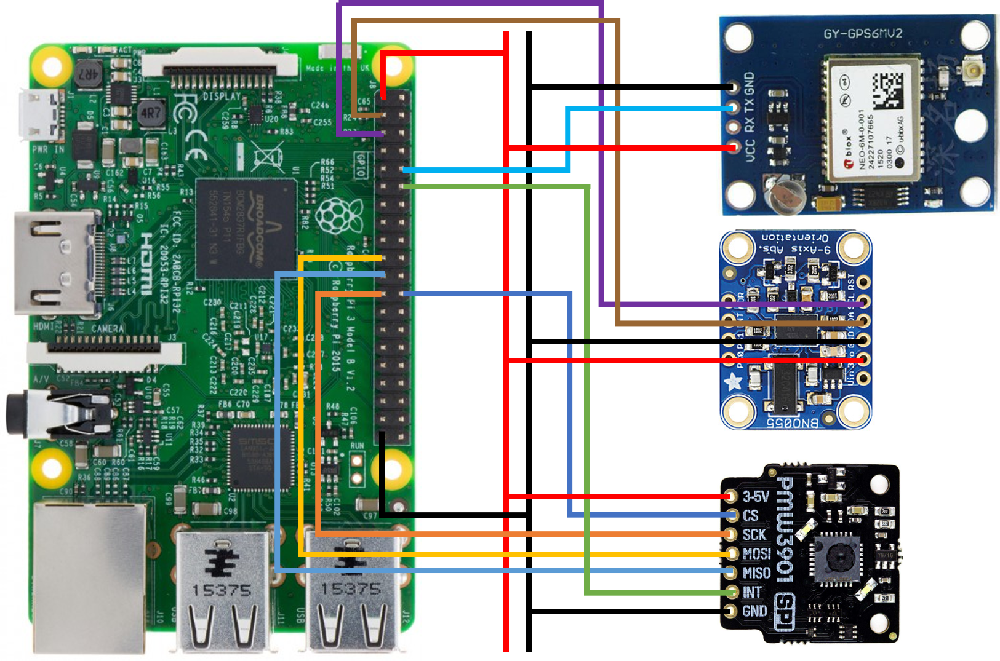

# telerob-sensor-integration
Integration of sensors for the driving platform.

### Hardware Platform for Test

#### Schematic Overview
```
+-----------+            +-------------+
|           |    Serial  |             |
|           |<---------->|   GPS       |
| Raspberry |            | GY GPS 6M V2|
|    Pi     |            +-------------+
|           |            +-------------+
|  192.     |    I2C     |             |
|  168.     |<---------->| Inertial    |
|  1.200    |            | Measurement |
|           |            | Unit        |
|           |            |             |
|           |            +-------------+
|           |            +-------------+
|           |    SPI     |             |
|           |<---------->|   Optical   |
|           |            |   Flow      |
+-----------+            +-------------+
```

#### Schematic Details
```
+-----------+     Serial Comm.   +-------------+
|           |<-Pin 10--------Tx->|             |
|           |<-GND ---------GND->|   GPS       |
| Raspberry |<-3V------------3V->| GY GPS 6M V2|
|    Pi     |                    +-------------+
|           |     I2C            +-------------+
|           |<-Pin 5--------SCL->|             |
|           |<-Pin 3--------SDA->| Inertial    |
|           |<-GND ---------GND->| Measurement |
|           |<-3V------------3V->| Unit (IMU)  |
|           |                    | BNO055      |
|           |                    +-------------+
|           |     SPI            +-------------+
|           |<-Pin 24--------CS->|             |
|           |<-Pin 23-------SCK->| Optical     |
|           |<-Pin 19------MOSI->| Flow        |
|           |<-Pin 21------MISO->|             |
|           |<-Pin 12-------INT->|             |
|           |<-GND ---------GND->| Pimoroni    |
|           |<-3V------------3V->| PMW3901     |
+-----------+                    +-------------+
```





### Connection to Raspberry Pi with Ethernet

* Raspberry Pi is configured with IP address 192.168.0.10
* Username: `pi` and Password: `raspberry` 
* connect in command line or linux shell via `ssh pi@192.168.0.10`

### How to configurate Wireless Acces Point using RASAP
  * [Python library](https://github.com/RaspAP/raspap-webgui) avaible
  * For IP Adress of wireless access point i recommend using different IP adress than in the guide to not have  problem with SSH. 
  * In this configuration PI is set with IP address: `10.3.141.10`
  * SSID: `PI`
  * Password: `raspberry`

### Information about sensors and their integration
* [Pimoroni PMW3901](https://shop.pimoroni.com/products/pmw3901-optical-flow-sensor-breakout)
  * [Python library](https://github.com/pimoroni/pmw3901-python) available 
   
* BNO055  
  * [Python library](https://github.com/adafruit/Adafruit_CircuitPython_BNO055) available
  * Follow the library's guide to install and test your sensor
  
* Neo GPS 6M V2 Installation

  * [Install Raspberry Pi OS using Raspberry Pi Imager](https://www.raspberrypi.org/software/) 

  * [Configurating IP adress](https://www.ionos.com/digitalguide/server/configuration/provide-raspberry-pi-with-a-static-ip-address/)  to be in same as you Local Area Network  
  
  * ENABLE SSH ==> https://www.raspberrypi.org/documentation/remote-access/ssh  
  Headless Connection to Raspberry Pi - Enable it by putting a file called ssh without file type on the sd card before putting it in the PI

  * Connect to Raspberry Pi and find the serial port, which Pi is connected to  
     Here is how to find which port your GPS is connected to
     ```
     dmesg | grep tty
     ```
     
     Here my GPS is connected to ttyS0  

  * Install GPSD and clients
     ```
     sudo apt update
     sudo apt upgrade
     sudo apt install gpsd gpsd-clients
     ```

     To check if gpsd is set up and running
     ```
     sudo service gpsd status
     ```
     Now gpsd is running, but it is not redirected to the serial port. You need to edit config file then restart gpsd service
     ```
     sudo nano /etc/default/gpsd
     DEVICES=/dev/ttyS0
     sudo service gpsd restart
     sudo service gpsd status
     sudo gpsmon
     ```
     The gpsd will redirect itself everytime it boots up
     
     
  * Using library for polling gpsd in Python3 
    * [Python library](https://github.com/MartijnBraam/gpsd-py3) avaible
